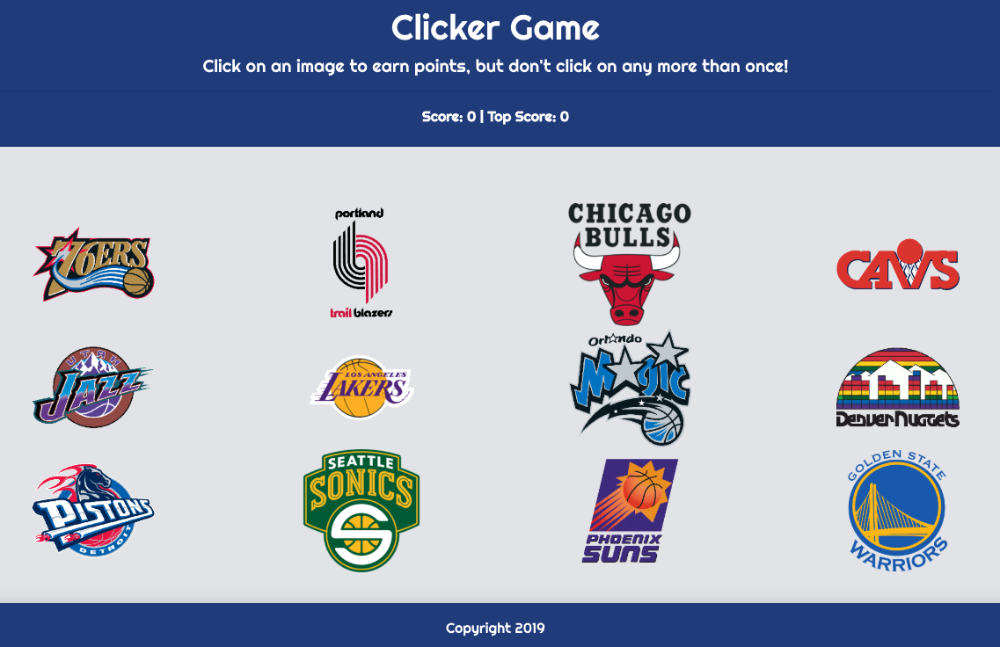

# Clicky

## SUMMARY
How good is your memory?
Find out by testing it with this React clicker game! 
There are 12 NBA teams on the screen. Your goal is to click all 12 teams once. If you click on the same picture twice, the game will reset and you have to start over. 
The catch is that these pictures shift with each click!

Good luck!

## GOALS
* Utilize React "state" to change where images are displayed on the screen
* Use on click functions to tie in with React state.
* Keep track of the user's score and reset the score when the game ends.

## DESIGN PROCESS
* Choose a theme.
* Create static React webpage.
* Add functionality and state to components to allow the user to interact with the DOM.

## TECHNOLOGY USED
* React
* CSS